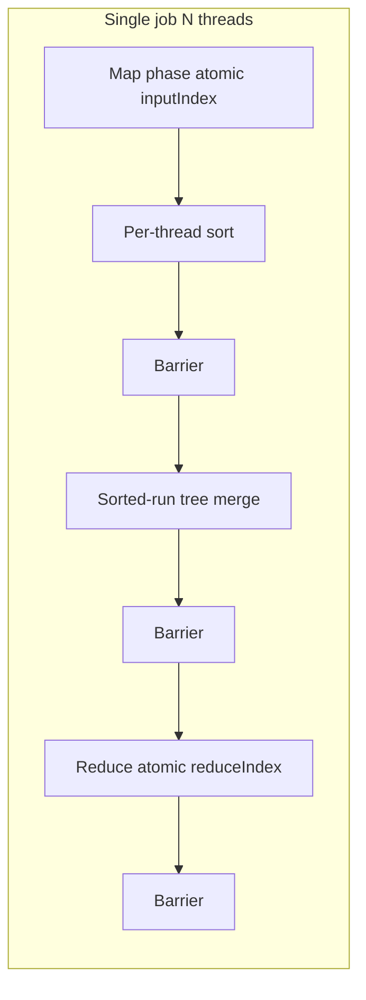
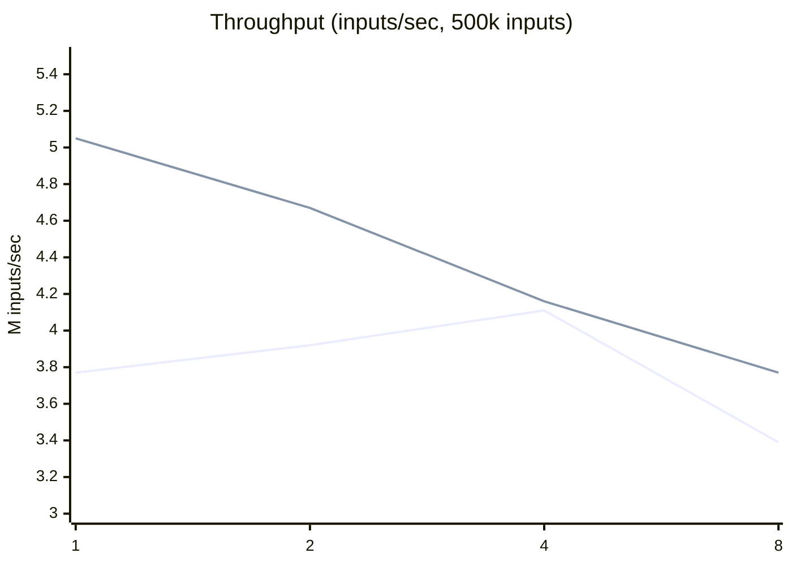

# MapReduce

Multithreaded C++20 MapReduce runtime with phase barriers, atomic work-stealing indices, lock-free per-thread map output, and **parallel k-way shuffle** (sorted runs + tree merge).

**What it is:** an in-process, multithreaded MapReduce framework (OS-course style API).

**What it is not:** a distributed/Hadoop-style cluster runtime.

## Architecture



## Build & test

```bash
cmake -B build -DCMAKE_BUILD_TYPE=Release
cmake --build build -j
ctest --test-dir build --output-on-failure
```

Or: `make build && make test`

## Word count on real text

Uses the first ~80KB of [Alice's Adventures in Wonderland](https://www.gutenberg.org/ebooks/11) (`examples/sample.txt`).

```bash
./build/word_count examples/sample.txt --top 15 --threads 4
```

Sample output:

```
the	703
and	469
to	416
a	364
she	345
it	321
of	254
i	253
was	219
in	198
alice	194
said	180
you	175
as	152
that	151
```

## Implementing a client

1. Subclass `MapReduceClient` and implement `map` / `reduce`.
2. Define key/value types for K1/V1 (input), K2/V2 (intermediate), K3/V3 (output).
3. In `map`, call `emit2` for intermediate pairs (heap-allocated; you own lifetimes until reduce).
4. In `reduce`, call `emit3` for final output (mutex-protected vector).
5. Call `startMapReduceJob`, then `waitForJob` / `getJobState`, then `closeJobHandle`.
6. Check `getJobError(job)` after the job finishes.

See `examples/word_count/` and `examples/char_frequency/`.

## Concurrency highlights

- **Generation barrier** — avoids spurious wakeups between rounds (`src/Barrier.cpp`).
- **Atomic indices** — `inputIndex` (map) and `reduceIndex` (reduce) distribute work.
- **K-way shuffle** — per-thread sort, parallel `std::merge` tree, linear group-by-key (`src/internal/Phases.cpp`).
- **Packed progress word** — `STATE_PACK` / `STATE_UNPACK` expose stage + percentage via `getJobState`.

Details: [docs/ARCHITECTURE.md](docs/ARCHITECTURE.md)

## Performance

Synthetic workload: 500k records, identity map, sum reduce. Median of 3 runs per thread count.

| Threads | Serial shuffle (v0) | Map tree merge | **Sorted-run merge (current)** |
|--------:|--------------------:|---------------:|-------------------------------:|
| 1 | 3.77M/s | 4.17M/s | **5.05M/s** |
| 2 | 3.92M/s | 4.26M/s | **4.67M/s** |
| 4 | 4.11M/s | 3.86M/s | **4.16M/s** |
| 8 | 3.39M/s | 3.45M/s | **3.77M/s** |



**What we learned:** Serial `std::map` shuffle on thread 0 capped speedup (Amdahl). Replacing it with a parallel merge of **already-sorted** per-thread runs removes map inserts and improves throughput at every thread count on this benchmark. Eight threads still plateau due to merge barriers and memory bandwidth.

```bash
make bench-sweep
perf stat -d ./build/bench --threads 8
```

See [docs/PERFORMANCE.md](docs/PERFORMANCE.md).

## Examples

```bash
./build/word_count examples/sample.txt --top 20 --threads 4
./build/char_frequency
./build/char_frequency --poll-progress
```
