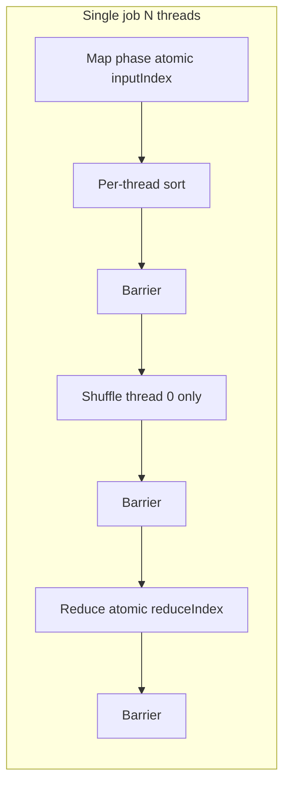

# MapReduce

Multithreaded C++20 MapReduce runtime with phase barriers, atomic work-stealing indices, and lock-free per-thread map output.

**What it is:** an in-process, multithreaded MapReduce framework (OS-course style API).

**What it is not:** a distributed/Hadoop-style cluster runtime.

## Architecture



## Build & test

```bash
cmake -B build -DCMAKE_BUILD_TYPE=Release
cmake --build build -j
ctest --test-dir build --output-on-failure
```

Or: `make build && make test`

## Implementing a client

1. Subclass `MapReduceClient` and implement `map` / `reduce`.
2. Define key/value types for K1/V1 (input), K2/V2 (intermediate), K3/V3 (output).
3. In `map`, call `emit2` for intermediate pairs (heap-allocated; you own lifetimes until reduce).
4. In `reduce`, call `emit3` for final output (mutex-protected vector).
5. Call `startMapReduceJob`, then `waitForJob` / `getJobState`, then `closeJobHandle`.
6. Check `getJobError(job)` after the job finishes.

See `examples/word_count/` and `examples/char_frequency/`.

## Concurrency highlights

- **Generation barrier** — avoids spurious wakeups between rounds (`src/Barrier.cpp`).
- **Atomic indices** — `inputIndex` (map) and `reduceIndex` (reduce) distribute work.
- **Packed progress word** — `STATE_PACK` / `STATE_UNPACK` expose stage + percentage via `getJobState`.

Details: [docs/ARCHITECTURE.md](docs/ARCHITECTURE.md)

## Benchmarks (sample, 500k inputs)

| Threads | inputs/sec |
|--------:|-----------:|
| 1 | 3.77M |
| 4 | 4.11M |
| 8 | 3.39M |

Shuffle on thread 0 limits scaling at high thread counts (Amdahl bottleneck).

```bash
./build/bench --threads 8
perf stat -d ./build/bench --threads 8   # Linux profiling
```

## Examples

```bash
./build/word_count /path/to/text.txt
./build/char_frequency
./build/char_frequency --poll-progress
```
